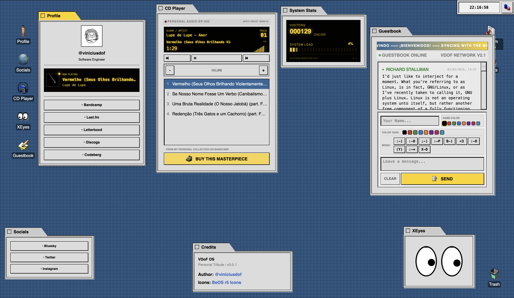

# VDoF OS (Homepage)

A year 2000 OS simulated in your modern browser just to show a few links. Progress is an illusion.

## Features (or bugs, who knows)

- **Pseudo-BeOS Interface**: A desktop experience that peaked in 1998. Modern UX is a nightmare. btw i was born in 1999.
- **System Monitor**: A high-tech LCD widget to track the "Online" users (actually is visitors count, but i like the word "Online").
- **Interactive Time-Wasters**:
  - **Bandcamp Player**: Streams my personal collection because I'm too cool for Spotify.
  - **Digital Guestbook**: A place to scream into the void.
  - **The Eyes**: They follow you. They know what you did. Don't make them cry.
- **Localized Misery**: Now available in English, Portuguese, and Spanish.

## Commands

Use [just](https://github.com/casey/just) as a command runner:

- `just install`: Download the entire internet into node_modules.
- `just dev`: Start the simulation.
- `just deploy`: deploy this piece of shit to Cloudflare workers, because i am a modern man.
